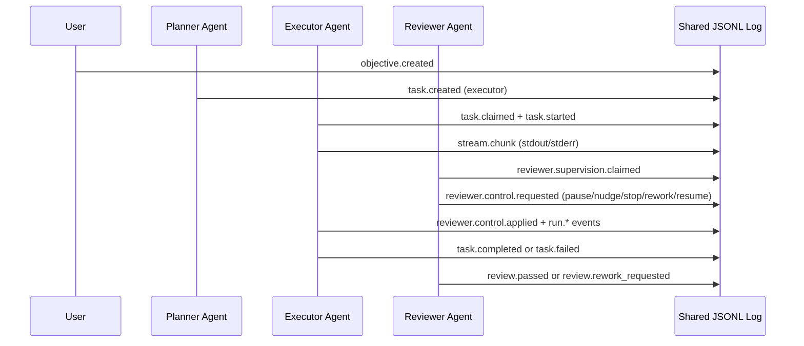

# Architecture

AgentBus uses a shared append-only JSONL file as the source of truth.

## Components

- `agentbus/store.py`: append/read with `fcntl` lock and incremental cursor reads.
- `agentbus/reducer.py`: deterministic event fold into task/chain/run/control state.
- `agentbus/runner.py`: role loops (planner/executor/reviewer), claiming, execution, supervision, steering.
- `agentbus/streaming.py`: nonblocking subprocess stream capture.
- `agentbus/actions.py`: strict structured action parsing and validation.
- `agentbus/adapters/*`: backend-specific command/session handling.

## Runtime Roles

- Planner: decomposes objectives and emits tasks.
- Executor: runs claimed tasks, streams output, applies live controls.
- Reviewer: claims supervision of active runs, analyzes stream windows, emits controls.

## Control Arbitration

Control precedence:
1. `stop`
2. `pause`
3. `rework`
4. `nudge`
5. `resume`

Tie-breaker: latest request timestamp.

## Sequence

## Safety Guards

- Single reviewer supervision lease per run.
- Lease expiration enables recovery from crashed agents.
- Duplicate task suppression via task fingerprint checks.
- Rework/failure/handoff budgets enforce bounded autonomy.
